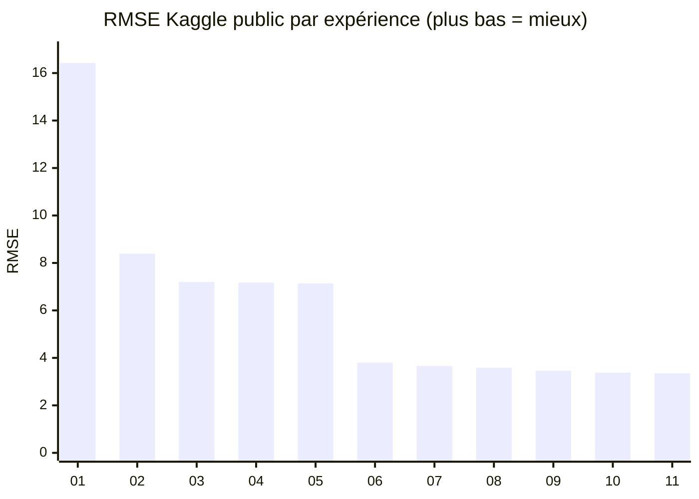
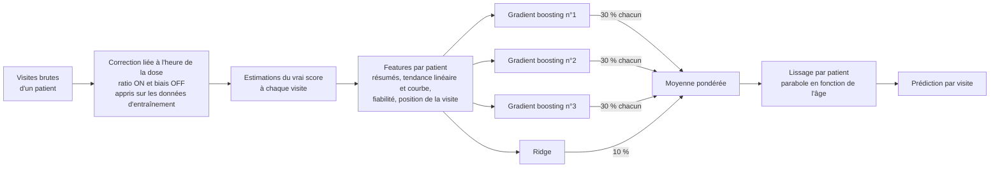

# Méthodologie — Prédire le score moteur « true OFF » de la maladie de Parkinson

IBM × Probabl Hackathon · Groupe 1 · Kaggle `ibm-probabl-hackathon`

*(English version: [`METHODOLOGY.md`](METHODOLOGY.md))*

---

## La version en une diapo

- **Tâche :** pour chaque visite d'un patient parkinsonien, prédire le score moteur MDS-UPDRS « true OFF » débiaisé (`target`, 0–132) à partir de mesures cliniques bruitées. Évalué en RMSE sur des **patients jamais vus à l'entraînement**.
- **Idée clé :** le vrai score d'un patient est une **courbe lisse et toujours croissante avec l'âge**, et les scores `on` / `off` mesurés à chaque visite en sont des **lectures bruitées**. Prédire chaque visite isolément gaspille l'essentiel de l'information ; **regrouper toutes les visites d'un patient** est ce qui marche.
- **Modèle final (`11_ensemble`) :** features par patient construites à partir de lectures corrigées de l'heure de la dose → moyenne de 3 modèles de gradient boosting réglés + 10 % de Ridge → les prédictions de chaque patient lissées en une courbe.
- **Résultat :** RMSE Kaggle public **3.35**, contre **7.14** à la fin du guide officiel et **16.42** en prédisant la moyenne — **53 % d'erreur en moins que le meilleur modèle du guide**.
- **Méthode :** un seul changement par expérience, chaque changement jugé sur la même **validation croisée groupée par patient**, le changement suivant choisi à partir de l'**analyse d'erreur** du modèle précédent, Kaggle utilisé comme contrôle indépendant.

---

## 1. Le problème

| | |
|---|---|
| **Données** | 44 590 visites d'entraînement (5 576 patients) · 11 013 visites de test (1 395 patients) · 4 à 12 visites par patient (médiane 7) |
| **Entrées par visite** | âge, âge au diagnostic, sexe, dose quotidienne de lévodopa (`ledd`), scores moteurs mesurés `on` et `off`, heures depuis la dernière prise pour chaque examen, gène, cohorte |
| **Cible** | score « true OFF » débiaisé, estimé par les organisateurs avec des informations que nous n'avons pas (moyenne 37.5, écart-type 16.5) |
| **Métrique** | RMSE (erreur moyenne de prédiction, en points de score ; plus bas = mieux) |
| **Contrainte forte** | les patients du test **n'apparaissent pas** dans le train — le modèle doit généraliser à de **nouveaux patients** |

**Pourquoi les scores mesurés sont biaisés :** l'examen OFF (patient sans médicament) est pénible et souvent sauté (42 % de valeurs manquantes) ; quand il est fait, la lévodopa peut encore agir en partie ; l'examen ON dépend fortement du temps écoulé depuis la prise ; et la notation est subjective. Notre modèle doit apprendre à défaire ces biais à partir des seules entrées.

---

## 2. Méthodologie

### 2.1 Un seul protocole d'évaluation pour tout : la validation croisée groupée par patient

Chaque patient a plusieurs visites. Si on découpe les visites au hasard, un même patient se retrouve à la fois dans l'entraînement et dans la validation : le modèle *reconnaît en partie la personne* et le score paraît meilleur qu'il ne le sera sur les nouveaux patients de Kaggle.

Chaque modèle est donc évalué avec **`GroupKFold(n_splits=5)` groupé par `patient_id`** : les patients sont répartis en 5 groupes ; on entraîne sur 4 et on évalue sur le 5e, cinq fois. Un patient est toujours entièrement d'un seul côté. **Les mêmes 5 folds** servent à toutes les expériences (`src/parkinson/data.py`), les scores sont donc directement comparables.

> Les étapes 7 à 9 du guide officiel utilisent volontairement un découpage aléatoire (premier contrôle) ; nous donnons les deux quand c'est pertinent.

### 2.2 Aucune fuite, par construction

- Les identifiants (`Index`, `patient_id`) ne sont **jamais** des features ; `patient_id` sert uniquement à regrouper les visites.
- Les features par patient n'utilisent **que les colonnes d'entrée**, jamais la cible — elles sont donc aussi disponibles sur le test, où chaque patient a aussi 4 à 12 visites.
- Tout ce qui est **appris à partir de la cible** (les corrections liées à l'heure de la dose, étape 07) vit **dans le pipeline du modèle**, et est donc réappris uniquement sur les folds d'entraînement pendant la validation croisée.

### 2.3 Chaque expérience est traçable

Pour chaque étape : un script dans `experiments/`, une explication dans `experiments/NN_nom.md`, deux **rapports Skore Hub** (un `EstimatorReport` sur des patients mis de côté, dont l'URL va dans la soumission Kaggle, et le `CrossValidationReport` sur 5 folds), une soumission Kaggle, une ligne dans `journal/JOURNAL.md` et un commit git.

### 2.4 Comment on a choisi quoi essayer ensuite

1. **Comprendre les données d'abord** (exploration, section 3) → hypothèses.
2. Changer **une seule chose** par expérience, tout le reste fixe.
3. Garder un changement seulement si le **RMSE en CV groupée** s'améliore.
4. Regarder **où le modèle se trompe** (analyse d'erreur par patient, nombre de mesures, position de la visite) et les **checks automatiques de skore** (overfitting, features inutiles…) → changement suivant.
5. Utiliser le **score public Kaggle** comme contrôle indépendant, pas comme objectif (optimiser le leaderboard public, c'est sur-apprendre dessus).

---

## 3. Ce que les données nous ont appris (exploration)

Ces constats ont guidé toutes les décisions de modélisation après le guide.

| Constat | Preuve | Conséquence |
|---|---|---|
| **La cible est une courbe lisse et croissante par patient** | une droite à travers les visites d'un patient l'ajuste à 1.2 point près en moyenne, une parabole à **0.2** ; la pente de chaque patient est positive (médiane **+2.4 points/an**) ; la cible ne baisse jamais entre deux visites consécutives | modéliser la courbe de chaque patient, pas des visites isolées |
| **80 % de la variance de la cible est entre patients** | variance intra-patient 54 contre 272 au total | le niveau global du patient est ce qui compte le plus |
| **`off` ≈ cible − 6**, bruité (±8) | biais moyen −6.0, écart-type 8.0 ; biais plus fort quand l'examen est proche de la prise | corriger `off` de l'heure de la dose |
| **`on` ≈ cible × 0.45–0.75** | ratio 0.75 dans les 30 min suivant la prise, 0.60 entre 30 et 60 min, 0.45 après 1h30 ; sans lien avec la dose quotidienne (corrélation 0.03) | convertir `on` en estimation de la cible avec une courbe de temps |
| **Chaque visite a `on` ou `off`** | 0 % des visites n'ont ni l'un ni l'autre | chaque visite apporte une lecture de la courbe |
| **Les valeurs manquantes sont fréquentes et informatives** | heures depuis la prise OFF 79 %, heures depuis la prise ON 46 %, `off` 42 %, `ledd` 37 %, `gene` 32 %, `on` 30 % manquants | ne jamais les remplir à l'aveugle ; utiliser des modèles qui traitent « manquant » comme une information |
| **Le gène et la cohorte comptent à peine** | rythme de progression 2.4–2.6 points/an dans tous les groupes de gènes, 2.5 contre 2.7 selon la cohorte | ne pas en attendre de gain |
| **Le test ressemble au train** | même nombre de visites par patient, mêmes taux de valeurs manquantes, même répartition des cohortes | les conclusions locales devraient se transposer à Kaggle |

---

## 4. Le parcours, étape par étape



| # | Expérience | Ce qui change | Pourquoi | RMSE CV groupée | Kaggle |
|---|---|---|---|---|---|
| 01 | `01_dummy` | prédire la moyenne du train | plancher à battre ; vérifie toute la chaîne (données → skore → Hub → Kaggle) | 16.48 | 16.42 |
| 02 | `02_ridge` | modèle linéaire sur 8 colonnes numériques, valeurs manquantes remplies par la médiane **+ indicateurs « était manquant »** | y a-t-il du signal ? les indicateurs gardent « examen OFF sauté » comme information (10.39 → 8.53 à eux seuls) | 8.54 | 8.39 |
| 03 | `03_hgbr` | arbres de gradient boosting, valeurs manquantes gérées nativement ; **passage à la CV groupée par patient** | effets non linéaires ; évaluation honnête à partir d'ici | 7.44 | 7.20 |
| 04 | `04_tabular_pipeline` | ajout de `gene` et `cohort` (skrub) | utiliser toutes les colonnes | 7.43 | 7.17 |
| 05 | `05_dataops` | même modèle sous forme de graphe skrub DataOps | le regroupement intégré au pipeline (sécurité, pas précision) | 7.43 | 7.14 |
| 06 | `06_patient_features` | **features tirées des autres visites du patient** : moyenne/médiane/min/max/nombre de `on`, `off`, `ledd` ; tendance linéaire de `on`/`off` avec l'âge, à l'âge de la visite ; position de la visite | exploration : la cible est une courbe par patient ; une visite est bruitée, l'ensemble ne l'est pas | **3.98** | **3.80** |
| 07 | `07_pk_correction` | convertir chaque mesure en estimation de la cible grâce à des **courbes liées à l'heure de la dose, apprises dans chaque fold** ; les combiner ; tendance pondérée par patient ; plus de régularisation | analyse d'erreur de 06 : les patients avec 0–1 mesure OFF avaient un RMSE de 5.7 contre 3.7 — leur courbe reposait sur des mesures ON non corrigées ; skore signalait de l'overfitting | 3.75 | 3.66 |
| 08 | `08_smoothing` | ajuster une **parabole en fonction de l'âge à travers les prédictions de chaque patient** | la vraie courbe est lisse ; les prédictions oscillaient de ±0.9 autour | 3.68 | 3.59 |
| 09 | `09_patient_curve` | tendance **courbe** par patient des estimations corrigées + niveau de bruit des mesures du patient | 62 % de l'erreur restante était un décalage de niveau par patient ; les tendances étaient des droites alors que la réalité est courbe | 3.50 | 3.46 |
| 10 | `10_tuning` | réglages du modèle choisis par une **recherche aléatoire** (30 combinaisons) sur les mêmes folds groupés ; test de sélection des colonnes | affiner le modèle une fois les features bonnes | 3.47 | 3.38 |
| 11 | `11_ensemble` | **moyenne des 3 meilleurs réglages (30 % chacun) + 10 % de Ridge** | des modèles différents font des erreurs en partie différentes | **3.43** | **3.35** |

### Ce que chaque phase nous a appris

- **01–05 (guide officiel) :** une meilleure famille de modèles aide (16.5 → 7.4), mais ajouter des colonnes (`gene`, `cohort`) ou réorganiser le pipeline, non. L'approche du guide plafonne vers **7.1–7.4** parce qu'elle prédit chaque visite isolément.
- **06 (la percée, −46 %) :** utiliser les autres visites du patient. C'est la décision la plus importante du projet, et elle vient directement de l'exploration.
- **07–09 (connaissances du domaine) :** chaque étape vise une erreur précise trouvée en analysant le modèle précédent — l'heure de la dose (pharmacocinétique de la lévodopa), la régularité de la progression de la maladie, la courbure de la trajectoire.
- **10–11 (affinage) :** le réglage et l'ensemble apportent des gains modestes mais fiables (−0.03 à −0.04 chacun en CV) : ce sont les features, pas les réglages, qui limitent désormais le modèle.

---

## 5. Le modèle final et pourquoi nous l'avons choisi



**Pourquoi ce modèle :**

1. **Meilleur score sur les deux mesures indépendantes :** CV groupée 3.43 et Kaggle public 3.35, le meilleur des 11 expériences.
2. **Il généralise :** la CV locale et Kaggle ont concordé à chaque étape (Kaggle systématiquement 0.04 à 0.24 plus bas), et la variation d'un fold à l'autre est faible (± 0.07). Les trois meilleurs réglages étaient à 0.002 les uns des autres — le résultat ne tient pas à une configuration chanceuse.
3. **Il repose sur les données et la médecine, pas sur des essais au hasard :** chaque composant répond à une observation documentée — les courbes par patient (exploration), l'effet de la lévodopa qui s'estompe en quelques heures (pharmacocinétique), la progression monotone de la maladie (neurodégénérescence).
4. **Il est sans fuite par construction :** aucune feature d'identifiant, features par patient issues des seules entrées, corrections basées sur la cible apprises dans chaque fold d'entraînement.
5. **Il reste simple là où c'est possible :** l'ensemble apporte 0.04 par rapport au meilleur modèle seul ; si l'interprétabilité ou la vitesse comptaient davantage, `10_tuning` (3.38 sur Kaggle) est un modèle unique presque équivalent.

---

## 6. Ce qui n'a pas marché (et pourquoi c'est important)

Les résultats négatifs font partie des preuves que les choix finaux sont les bons.

| Essai | Résultat | Leçon |
|---|---|---|
| Régler l'`alpha` du Ridge (0.1 → 100) | aucun changement (8.53) | avec ~35 000 visites et 14 colonnes, la régularisation compte à peine pour un modèle linéaire |
| Ajouter `gene` et `cohort` | 7.44 → 7.43 | ils ne pilotent pas la progression (confirmé par l'exploration) |
| Retirer les colonnes jugées inutiles par skore (`sexM`, `gene`, `cohort`) | 3.497 → 3.498 | inoffensives mais inutiles — gardées pour la simplicité du pipeline |
| Lisser les prédictions par une droite | pire (3.81 contre 3.75) | la vraie trajectoire est courbe ; une parabole l'ajuste (3.68) |
| Lissage isotonique (uniquement croissant) | 3.73 | la parabole capte mieux la forme |
| Pondérer la courbe du patient par la fiabilité des mesures | 3.53 contre 3.50 | avec 4 à 12 points par patient, les poids ajoutent de l'instabilité |
| Plus de Ridge dans l'ensemble (20 %, 30 %) | 3.44, 3.46 | un modèle plus faible n'aide qu'à petite dose |
| Recalibrer les prédictions (y ≈ a + b·prédiction) | pente 1.00, aucun gain | les prédictions sont globalement sans biais |

---

## 7. Validation et honnêteté sur les chiffres

- **CV locale vs Kaggle :** à chaque étape, le RMSE Kaggle public était 0.04 à 0.24 en dessous de la CV groupée — toujours un peu meilleur, jamais pire. Le classement des expériences est identique des deux côtés.
- **Léger optimisme pour 10 et 11 :** les réglages et les poids de l'ensemble ont été choisis sur les mêmes folds qui les évaluent. Le score Kaggle (patients jamais vus) est le contrôle indépendant, et il confirme les gains (3.46 → 3.38 → 3.35).
- **Leaderboard public vs privé :** le score public utilise une partie du test ; le classement final utilise le reste. Comme nous avons optimisé la CV groupée et non le leaderboard public, nous nous attendons à un score privé proche.

## 8. Limites et pistes

- Les patients avec très peu de mesures OFF restent les plus difficiles ; **rapprocher leur courbe de la courbe moyenne de la population** (Bayes empirique / modèle à effets mixtes) est la piste la plus prometteuse.
- Les **combinaisons de valeurs manquantes** (quelles mesures manquent ensemble) par patient pourraient porter une information sur le protocole.
- Le modèle prédit à partir de **tout** l'historique du patient, visites futures comprises — correct pour cette compétition, mais un outil clinique en temps réel n'aurait que les visites passées.

---

## 9. Reproduire les résultats

```bash
# installation (Windows : setup\windows\setup.bat)
bash setup/unix/setup.sh
# CSV Kaggle dans data/, puis n'importe quelle expérience :
python experiments/11_ensemble.py --no-hub   # exécution locale
python experiments/11_ensemble.py            # + rapports Skore Hub et CSV de soumission
```

| Où | Quoi |
|---|---|
| `experiments/NN_nom.py` / `.md` | chaque expérience et son explication |
| `src/parkinson/data.py` | chargement des données, folds groupés par patient, écriture validée des soumissions |
| `src/parkinson/features.py` | `PatientFeatures` (06), `PatientPKFeatures` (07), `PatientCurveFeatures` (09) |
| `src/parkinson/models.py` | `PatientSmoother` (08) |
| `journal/JOURNAL.md` | index des expériences avec les liens vers les rapports Hub |
| [Projet Skore Hub](https://skore.probabl.ai/ibmhackathongroup1/ibm-hackathon) | tous les rapports (`NN_nom` et `NN_nom_cv`) |

---

## Questions probables — réponses courtes

**Pourquoi ne pas simplement utiliser le modèle du guide des organisateurs ?** Il prédit chaque visite isolément et plafonne vers 7.1 sur Kaggle. Les données montrent que la cible est une courbe par patient ; utiliser les autres visites du patient divise l'erreur par deux.

**Utiliser les autres visites du même patient, ce n'est pas tricher ?** Non. Nous n'utilisons que les colonnes d'entrée (jamais la cible), et le test fournit le même type d'historique pour chaque patient (4 à 12 visites). L'évaluation est groupée par patient : les patients de validation ne sont jamais vus à l'entraînement.

**Comment savez-vous que vous ne sur-apprenez pas ?** La CV groupée par patient reproduit le découpage de Kaggle, les mêmes folds servent à toutes les expériences, les corrections basées sur la cible sont apprises dans chaque fold d'entraînement, et les scores Kaggle (patients jamais vus) suivent notre CV à chaque étape.

**Pourquoi un ensemble plutôt qu'un seul modèle ?** Faire la moyenne de trois modèles aussi bons mais configurés différemment, plus une petite dose d'un modèle linéaire dont les erreurs diffèrent, réduit l'erreur gratuitement (−0.04). C'est optionnel : `10_tuning` seul est à 0.02 près sur Kaggle.

**Quelle a été la décision la plus importante ?** Explorer les données avant de modéliser : c'est ce qui a révélé la courbe par patient et mené directement aux 46 % d'amélioration de l'étape 06.
