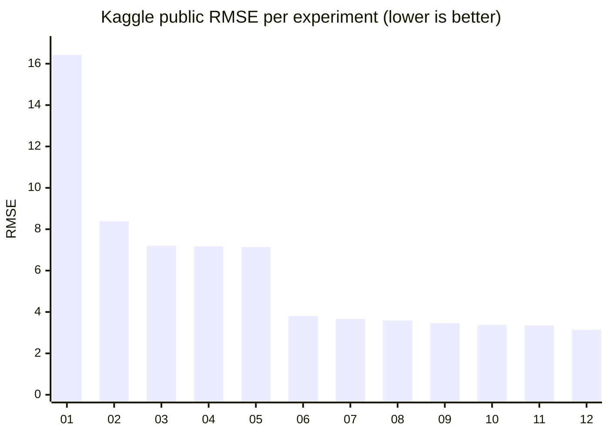
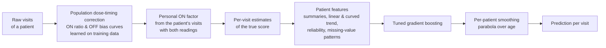

# Methodology — Predicting the "true OFF" Parkinson's motor score

IBM × Probabl Hackathon · Group 1 · Kaggle `ibm-probabl-hackathon`

*(Version française : [`METHODOLOGIE.md`](METHODOLOGIE.md))*

---

## The one-slide version

- **Task:** for every clinic visit of a Parkinson's patient, predict the debiased "true OFF" MDS-UPDRS motor score (`target`, 0–132) from noisy clinic measurements. Scored by RMSE on **patients never seen in training**.
- **Key insight:** a patient's true score is a **smooth, always-increasing curve over age**, and each visit's measured `on` / `off` score is a **noisy reading** of that curve. Predicting each visit alone wastes most of the information; **pooling all of a patient's visits** is what works.
- **Final model (`12_personal_calibration`):** every reading is corrected for dose timing (population curves) **and for the patient's personal response to levodopa**, turned into an estimate of the true score, summarised into patient-level features (trends, reliability, missing-value patterns) → one tuned gradient-boosting model → each patient's predictions smoothed into a curve.
- **Result:** Kaggle public RMSE **3.14**, vs **7.14** at the end of the official guide and **16.42** for predicting the average — **56 % less error than the guide's best model**.
- **Method:** one change per experiment, every change judged on the same **patient-grouped cross-validation**, the next change chosen from **error analysis** of the previous model, Kaggle used as an independent check.

---

## 1. The problem

| | |
|---|---|
| **Data** | 44,590 training visits (5,576 patients) · 11,013 test visits (1,395 patients) · 4–12 visits per patient (median 7) |
| **Inputs per visit** | age, age at diagnosis, sex, levodopa daily dose (`ledd`), measured `on` and `off` motor scores, hours since last dose for each exam, gene, cohort |
| **Target** | debiased "true OFF" score, estimated by the organisers from information we do not get (mean 37.5, standard deviation 16.5) |
| **Metric** | RMSE (average prediction error, in score points; lower is better) |
| **Hard constraint** | test patients do **not** appear in training — the model must generalise to **new patients** |

**Why the measured scores are biased:** the OFF exam (patient without medication) is uncomfortable and often skipped (42 % missing); when it is done, levodopa may still be partly active; the ON exam depends strongly on how long ago the dose was taken and on how strongly the patient responds to the drug; and scoring is subjective. Our model has to learn to undo these biases from the inputs alone.

---

## 2. Methodology

### 2.1 One evaluation protocol for everything: patient-grouped cross-validation

Each patient has several visits. If we split visits at random, the same patient ends up in both training and validation: the model partly *recognises the person* and the score looks better than it will be on Kaggle's new patients.

So every model is evaluated with **`GroupKFold(n_splits=5)` grouped by `patient_id`**: patients are split into 5 groups; the model is trained on 4 and scored on the 5th, five times. A patient is always entirely on one side. The **same 5 folds** are used for every experiment (`src/parkinson/data.py`), so scores are directly comparable.

> Steps 7–9 of the official guide use a random split on purpose (as a first check); we report both where relevant.

### 2.2 No leakage, by construction

- Identifiers (`Index`, `patient_id`) are **never** features; `patient_id` is only used to group visits.
- Patient-level features use **input columns only**, never the target — they are equally available on the test set, where each patient also has 4–12 visits.
- Anything **learned from the target** (the population dose-timing curves) lives **inside the model pipeline**, so it is re-learned on the training folds only during cross-validation. The personal drug-response factor uses only the patient's own input readings.

### 2.3 Every experiment is traceable

For each step: a script in `experiments/`, an explanation in `experiments/NN_name.md`, two **Skore Hub reports** (an `EstimatorReport` on held-out patients, whose URL goes in the Kaggle submission, and the 5-fold `CrossValidationReport`), a Kaggle submission, a row in `journal/JOURNAL.md`, and one git commit. Ideas that did not pan out are logged in the journal as *abandoned*, with their score.

### 2.4 How we decided what to try next

1. **Understand the data first** (exploration, section 3) → hypotheses.
2. Change **one thing** per experiment, keep everything else fixed.
3. Keep a change only if the **grouped-CV RMSE** improves.
4. Look at **where the model is wrong** (error analysis by patient, number of readings, which readings are missing, visit position) and at **skore's automatic checks** (overfitting, useless features…) → next change.
5. Use the **Kaggle public score** as an independent sanity check, not as the thing we optimise (optimising the public leaderboard overfits it).

---

## 3. What the data told us (exploration)

These findings drove every modelling decision after the guide.

| Finding | Evidence | Consequence |
|---|---|---|
| **The target is a smooth, increasing curve per patient** | a straight line through one patient's visits fits within 1.2 points on average, a parabola within **0.2**; every patient's slope is positive (median **+2.4 points/year**); the target never decreases between consecutive visits | model each patient's curve, not isolated visits |
| **80 % of the target's variance is between patients** | within-patient variance 54 vs total 272 | the patient's overall level is what matters most |
| **`off` ≈ target − 6**, noisy (±8) | mean bias −6.0, standard deviation 8.0; bias larger when the exam is closer to the dose, and growing with disease duration (−3.9 in the first 2 years, −11.2 after 12) | correct `off` for dose timing |
| **`on` ≈ target × 0.45–0.75** | ratio 0.75 within 30 min of the dose, 0.60 at 30–60 min, 0.45 after 1.5 h; unrelated to disease duration or daily dose | convert `on` into a target estimate with a timing curve |
| **The drug response is partly personal** | 39 % of the variation of the ON / true-score ratio is between patients | calibrate each patient's ON readings on their own visits (step 12) |
| **Every visit has `on` or `off`** | 0 % of visits have neither | every visit carries a reading of the curve |
| **Missing values are frequent and informative** | hours since OFF dose 79 %, hours since ON dose 46 %, `off` 42 %, `ledd` 37 %, `gene` 32 %, `on` 30 % missing | never blindly fill them; treat "missing" as information |
| **Gene and cohort barely matter** | progression rate 2.4–2.6 points/year in every gene group, 2.5 vs 2.7 by cohort | do not expect gains from them |
| **Test looks like train** | same visits per patient, same missing rates, same cohort mix | local conclusions should carry over to Kaggle |

---

## 4. The journey, step by step



| # | Experiment | What changed | Why | Grouped CV RMSE | Kaggle |
|---|---|---|---|---|---|
| 01 | `01_dummy` | predict the training mean | floor to beat; checks the whole pipeline (data → skore → Hub → Kaggle) | 16.48 | 16.42 |
| 02 | `02_ridge` | linear model on 8 numeric columns, missing values filled with the median **+ "was missing" indicators** | is there any signal? indicators keep "OFF exam skipped" as information (10.39 → 8.53 on their own) | 8.54 | 8.39 |
| 03 | `03_hgbr` | gradient-boosted trees, missing values handled natively; **switch to patient-grouped CV** | non-linear effects; honest evaluation from here on | 7.44 | 7.20 |
| 04 | `04_tabular_pipeline` | add `gene` and `cohort` (skrub) | use every column | 7.43 | 7.17 |
| 05 | `05_dataops` | same model as a skrub DataOps graph | grouping baked into the pipeline (safety, not accuracy) | 7.43 | 7.14 |
| 06 | `06_patient_features` | **features from the patient's other visits**: mean/median/min/max/count of `on`, `off`, `ledd`; linear trend of `on`/`off` over age at this visit's age; visit position | exploration: the target is a per-patient curve; one visit is noisy, all of them are not | **3.98** | **3.80** |
| 07 | `07_pk_correction` | convert every reading into a target estimate using **dose-timing curves learned in-fold**; combine them; weighted trend per patient; more regularisation | error analysis of 06: patients with 0–1 OFF readings had RMSE 5.7 vs 3.7 — their curve relied on uncorrected ON readings; skore flagged overfitting | 3.75 | 3.66 |
| 08 | `08_smoothing` | fit a **parabola over age through each patient's predictions** | the true curve is smooth; predictions wiggled ±0.9 around it | 3.68 | 3.59 |
| 09 | `09_patient_curve` | **curved** per-patient trend of the corrected estimates + how noisy the patient's readings are | 62 % of the remaining error was a per-patient level offset; trends were straight lines while the truth bends | 3.50 | 3.46 |
| 10 | `10_tuning` | model settings chosen by a **randomized search** (30 combinations) on the same grouped folds; column-selection test | squeeze the model once the features are right | 3.47 | 3.38 |
| 11 | `11_ensemble` | average of the 3 best settings (30 % each) + 10 % Ridge | different models make partly different errors | 3.43 | 3.35 |
| 12 | `12_personal_calibration` | **personal ON factor** per patient, learned from their visits with both readings; **missing-value patterns** | error analysis of 10: ON-only visits were the hardest (RMSE 3.9–4.2 vs 2.4 when OFF was measured), and 39 % of the drug-response variation is personal | **3.29** | **3.14** |

### What each phase taught us

- **01–05 (official guide):** a better model family helps (16.5 → 7.4), but adding columns (`gene`, `cohort`) or re-packaging the pipeline does not. The guide's approach plateaus around **7.1–7.4** because it predicts every visit in isolation.
- **06 (the breakthrough, −46 %):** using a patient's other visits. This is the single most important decision of the project and comes directly from the exploration.
- **07–09 (domain knowledge):** each step targets a specific error found by analysing the previous model — dose timing (pharmacokinetics of levodopa), smoothness of disease progression, curvature of the trajectory.
- **10–11 (refinement):** tuning and ensembling give small, reliable gains (−0.03 to −0.04 each in CV): at that point the features, not the settings, limited the model.
- **12 (personalisation, −5 % in CV, −6 % on Kaggle):** a new round of error analysis showed the remaining error was concentrated on ON-only visits, and that patients respond differently to the drug. Calibrating each patient's ON readings on their own data gave the biggest gain since step 09 — **with a single model** that beats the step-11 ensemble.

---

## 5. The final model and why we chose it



**Why this model:**

1. **Best score on both independent measures:** grouped CV 3.29 and Kaggle public 3.14, the best of all 12 experiments.
2. **It generalises:** local CV and Kaggle have agreed at every step (Kaggle consistently 0.04–0.24 lower, never higher), with small fold-to-fold variation (± 0.06).
3. **It is grounded in the data and the medicine, not in trial and error:** each component answers a documented observation — patient curves (exploration), levodopa's effect decaying over hours (pharmacokinetics), individual differences in drug response, monotonic disease progression (neurodegeneration).
4. **It is leak-free by construction:** no identifier features, patient features from inputs only, target-based corrections learned inside each training fold.
5. **It is a single model:** simpler, faster and more explainable than the step-11 ensemble, and better (3.14 vs 3.35 on Kaggle).

---

## 6. What did not work (and why that matters)

Negative results are part of the evidence that the final choices are the right ones.

| Tried | Result | Lesson |
|---|---|---|
| Tuning Ridge's `alpha` (0.1 → 100) | no change (8.53) | with ~35 000 visits and 14 columns, regularisation barely matters for a linear model |
| Adding `gene` and `cohort` | 7.44 → 7.43 | they do not drive progression (confirmed by exploration) |
| Dropping the columns skore flagged as useless (`sexM`, `gene`, `cohort`) | 3.497 → 3.498 | harmless but useless — kept for simplicity of the pipeline |
| Straight-line smoothing of predictions | worse (3.81 vs 3.75) | the true trajectory bends; a parabola fits it (3.68) |
| Isotonic (increasing-only) smoothing | 3.73 | the parabola captures the shape better |
| Weighting the patient curve by reading reliability | 3.53 vs 3.50 | with 4–12 points per patient, weights add instability |
| More Ridge in the ensemble (20 %, 30 %) | 3.44, 3.46 | a weaker model helps only in small doses |
| Recalibrating predictions (y ≈ a + b·prediction) | slope 1.00, no gain | predictions are unbiased overall |
| **Empirical-Bayes curve per patient** (prior learned from training patients, readings as noisy observations) | 3.472 vs 3.467 (curve alone: 5.42) | the trees already extract this from the number of readings and their spread |
| **Multiplicative OFF correction** (a ratio, like ON) | per-visit error 9.18 vs 7.85 additive | the OFF bias is an offset, not a proportion |
| **OFF correction by dose timing *and* disease duration** | per-visit error 7.90 vs 7.85 | the bias does grow with duration, but visit-level noise dominates |

---

## 7. Validation and honesty about the numbers

- **Local CV vs Kaggle:** every step, Kaggle public RMSE was 0.04–0.24 below the grouped CV — always slightly better, never worse. The ranking of experiments is identical on both.
- **Slight optimism from step 10 on:** the model settings (reused in 12) and the ensemble weights were chosen on the same folds that score them. The Kaggle score (unseen patients) is the independent check, and it confirms every gain (3.46 → 3.38 → 3.35 → 3.14).
- **Public vs private leaderboard:** the public score uses part of the test set; the final ranking uses the rest. Because we optimised grouped CV rather than the public leaderboard, we expect the private score to be close.

## 8. Limitations and next steps

- **Ensembling on the step-12 features** (as step 11 did for step 10) is the obvious next experiment; it gained 0.02–0.04 before.
- The per-patient **level offset** is still the largest share of the remaining error; better use of patients' ON-only histories (e.g. a personal OFF bias) is the next idea.
- The model predicts from a patient's **whole** history, including later visits — right for this competition, but a clinical tool predicting in real time would only have past visits.

---

## 9. Reproducing the results

```bash
# one-time setup (Windows: setup\windows\setup.bat)
bash setup/unix/setup.sh
# Kaggle CSVs into data/, then any experiment:
python experiments/12_personal_calibration.py --no-hub   # local run
python experiments/12_personal_calibration.py            # + Skore Hub reports and submission CSV
```

| Where | What |
|---|---|
| `experiments/NN_name.py` / `.md` | each experiment and its explanation |
| `src/parkinson/data.py` | data loading, patient-grouped folds, validated submission writer |
| `src/parkinson/features.py` | `PatientFeatures` (06), `PatientPKFeatures` (07), `PatientCurveFeatures` (09), `PatientPersonalFeatures` (12) |
| `src/parkinson/models.py` | `PatientSmoother` (08) |
| `journal/JOURNAL.md` | experiment index with Hub report links, including abandoned ideas |
| [Skore Hub project](https://skore.probabl.ai/ibmhackathongroup1/ibm-hackathon) | every report (`NN_name` and `NN_name_cv`) |

---

## Likely questions — short answers

**Why not just use the organisers' guide model?** It predicts each visit alone and plateaus at ~7.1 on Kaggle. The data shows the target is a per-patient curve; using the patient's other visits more than halves the error.

**Isn't using other visits of the same patient cheating?** No. We only use input columns (never the target), and the test set provides the same kind of history for each test patient (4–12 visits). Evaluation is grouped by patient, so validation patients are never seen in training.

**What is the "personal calibration"?** Patients respond differently to levodopa: for the same hours since the dose, one patient's ON score may be 40 % of their true score, another's 55 %. When a patient had both exams at some visits, we measure their personal response there and use it to correct their ON-only visits.

**How do you know you are not overfitting?** Patient-grouped CV mirrors the Kaggle split, the same folds are used for every experiment, target-based corrections are learned inside each training fold, and Kaggle scores (unseen patients) track our CV at every step.

**Why a single model and not the ensemble?** The step-12 single model beats the step-11 ensemble by 0.2 on Kaggle, and is simpler to explain and run. Ensembling on the new features may add a little more; it is the next experiment.

**What was the single most important decision?** Exploring the data before modelling, which revealed the per-patient curve — it led directly to the 46 % improvement of step 06. Every later gain came from the same habit: look at where the model is wrong, then explain why.
